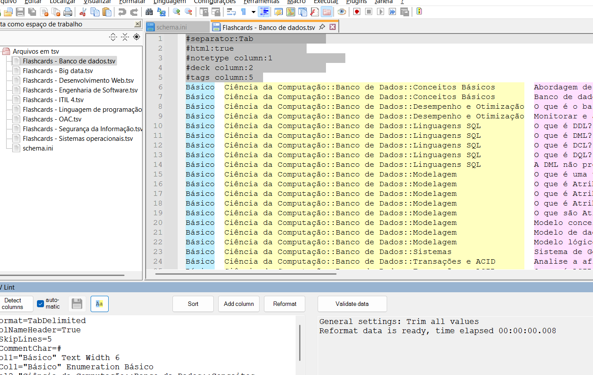

# Flashcards para Anki

Este projeto visa criar um repositório colaborativo com diversos flashcards para o Anki. O intuito é ajudar tanto no estudo para concursos quanto no estudo de matérias em universidades.

## Estrutura do Projeto

O projeto possui duas pastas principais:

### 1. `arquivos_tsv`
Essa pasta contém todos os arquivos de flashcards, organizados por matéria. Dentro de cada subpasta, os decks são armazenados separadamente. Por exemplo, para a matéria **Ciência da Computação**, há uma pasta correspondente que contém todos os decks sobre esse assunto. Cada arquivo representa um deck diferente.

Todos os arquivos possuem um cabeçalho configurado da seguinte forma:

```
#separator:Tab  
#html:true  
#notetype column:1  
#deck column:2  
#tags column:5  
```

Esse cabeçalho define algumas configurações para que o Anki saiba interpretar corretamente o arquivo. Como o separador é **Tab**, os arquivos são salvos no formato **TSV** para evitar problemas de compatibilidade.

### 2. `fonte_dos_flashcards`
Essa pasta serve para armazenar as fontes utilizadas na criação dos decks, como imagens de livros, sites e outros materiais de referência. Não é necessário colocar tudo na íntegra, apenas o suficiente para manter a organização e possibilitar a citação de imagens nos decks.

## Como Colaborar?

Há duas formas principais de editar os arquivos. Você pode escolher a que melhor se adapta ao seu fluxo de trabalho.

### Método 1: Google Planilhas
- Vantagem: Interface intuitiva e edição facilitada.
- Desvantagem: Requer conexão com a internet e é necessário baixar o arquivo atualizado para substituí-lo no repositório.

### Método 2: Notepad++ (Recomendado)

O Notepad++ não é um editor de planilhas, mas pode ser usado para editar os arquivos TSV como se fossem arquivos de texto. Para facilitar a visualização das colunas, recomenda-se o uso do plugin **CSV Lint**.

 <!-- Adicionar link da imagem caso disponível -->

Após adicionar novas linhas ao final do arquivo, basta salvar.

## Padrões para Organização dos Decks

Para manter a organização dos decks, siga este padrão de nomenclatura:

1. O nome do deck deve seguir a estrutura:  
   ```
   [Nome da disciplina]::[Nome do Deck]
   ```
   **Exemplo:**
   ```
   Ciência da Computação::Banco de Dados
   ```

2. Caso necessário, pode-se criar até **dois subdecks** para tornar o conteúdo mais específico. Porém, evite nomes excessivamente longos.
   ```
   [Nome da disciplina]::[Subdeck1]::[Subdeck2]
   ```
   **Exemplo:**
   ```
   Ciência da Computação::Banco de Dados::Fundamentos
   ```

## Sugestões

Se tiver alguma sugestão de melhoria ou quiser contribuir com novos decks, fique à vontade para entrar em contato ou abrir um pull request no repositório!

---
📌 **Mantenha o padrão para garantir que os decks fiquem organizados!**
